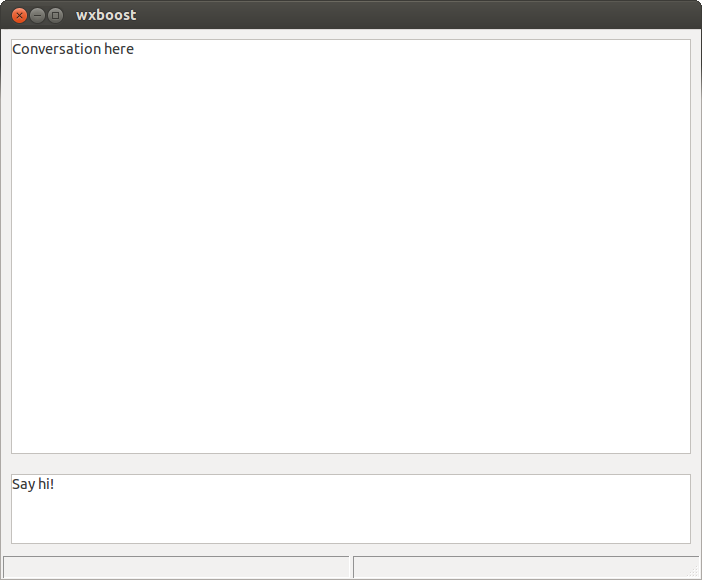
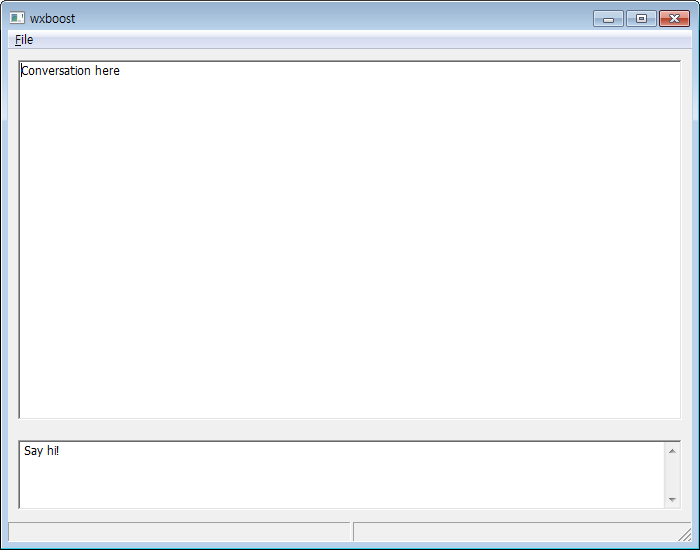

This project is a means to exercise and learn **boost.asio** and **wxwidgets**.

You can learn from this project if you want.
But make sure nobody is responsible for anything as always.

References
----------

http://www.boost.org/doc/libs/1_53_0/doc/html/boost_asio/examples.html

http://zetcode.com/gui/wxwidgets/

Journeyer J. Joh

